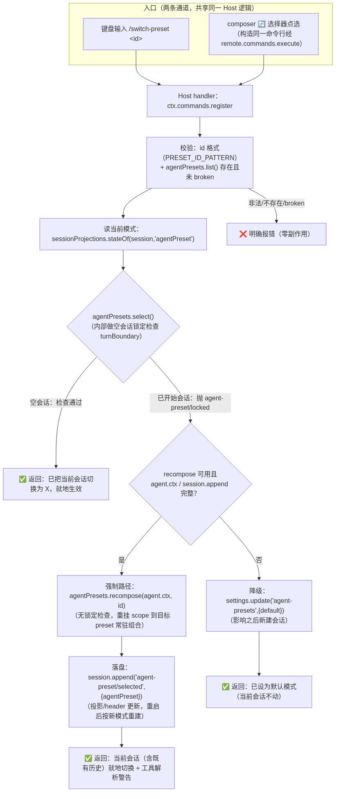
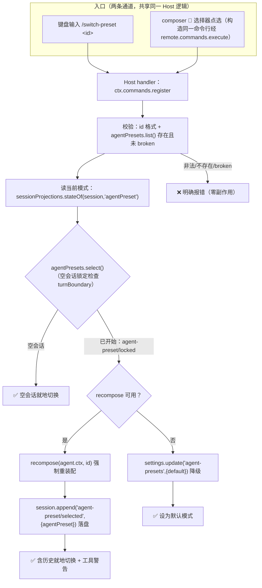

# Architecture — dsh-switch-preset

> v3.0.0（2026-09-18）：对应代码 v0.3.0——`/switch-preset` 对已开始会话走
> **recompose 强制切换**；`/list-preset` 列中文清单；已移除自动跳转/设置卡/fork-create。
> 历史语义见 CHANGELOG 0.1.0~0.2.x。

## 边界

- **Host**：`ctx.commands` 注册 `/switch-preset` 与 `/list-preset` 两条命令
  （`src/host/command.ts`）；切换/列表纯逻辑在 `src/host/switch.ts`（服务以接口注入，可单测）。
- **Client**：仅一个入口——`conversation.input.right` 模式选择器（🔄 按钮 + roster 弹层，
  点选经 `remote.commands.execute('/switch-preset <id>')` 复用命令通道，无第二套逻辑）。
- **Shared**：`contracts.ts` 保存服务最小契约、命令名、设置键、preset id 格式（单一真源）。

## 状态模型

插件**不自建会话状态**：

| 状态 | 真源 | 说明 |
|---|---|---|
| 当前会话模式 | session 投影 `agentPreset` | 由 `agent-preset/selected` 持久事件折叠而来 |
| 可用模式清单 | `agentPresets.list()` roster | 含中文名/描述/默认标注/broken，实时读取不缓存 |
| 默认模式 | settings 命名空间 `agent-presets.default` | 降级路径写入，影响新建会话 |

切换动作本身（recompose/select）会写一条 `agent-preset/selected` 持久事件——保证
投影/header 一致，resume/fork/重启按新模式重建。

## 注入清单

- 插件级 `inject`：`commands`、`agentPresets`（必需）。
- `sessionProjections`：经 `ctx.get` 惰性取（读当前模式；缺失时列表标注降级）。
- `settings`：**必须经 `ctx.inject(['settings'], cb)` 二次注入**（cordis 的 `get` 取不到
  未声明服务，0.2.1 修）；命令每次执行时惰性解析（服务可能晚于 apply 就绪）。
- Client `dsh.client.inject`：`slots`、`remote.commands`、`remote.agentPresets`。

## 实现调用链（v0.3.0）

源文件：`docs/02-design/switch-preset-flow.mmd`（mermaid，`mmdc` 渲染）。

## 已知框架边界

1. **已开始会话换 preset 默认被 DSH 锁死**（`select` 按 `turnBoundary` 拒绝，原因：
   换 preset = 换工具集，历史 tool 调用在新组合下可能无法解析）。v0.3.0 按用户要求
   对已开始会话走 `recompose` 强制重装配（无锁定检查），成功文案附风险提示。
2. **降级链**：recompose 缺失（宿主版本差异）→ 写默认模式 → 两者都不可用 → 明确报错，
   任何路径都不静默失败。
3. 当前会话模式与目标相同 → 幂等成功（不 recompose、不写默认）。
4. `settings` 服务缺失时写默认模式明确报错（0.2.x 保留行为）。