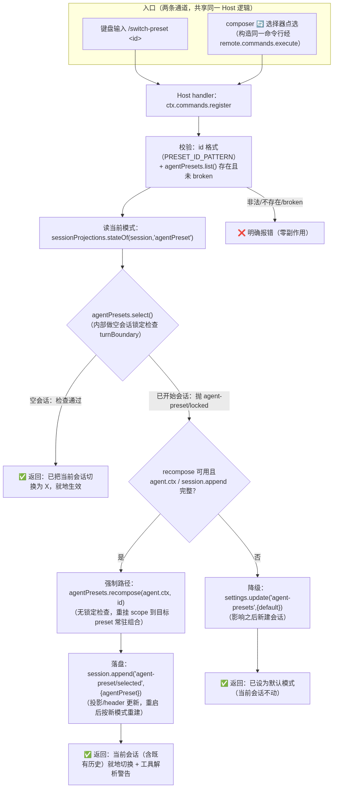
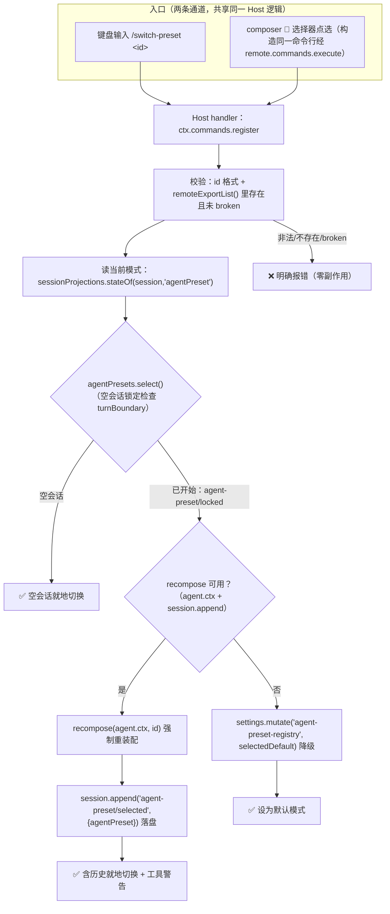

## 当前状态

- 文档性质：设计/架构
- 对应版本：v0.5.0（2026-09-28）
- 状态：有效（如与实现不符，以代码与 `docs/REQUIREMENTS.md` 为准）
- 维护者：AI + 用户

# Architecture — dsh-switch-preset

> v3.1.0（2026-09-26）：注入/设置面按 harness 0.1.7 原地对齐（二级注入、`remoteExportList()`、
> `agent-preset-registry.selectedDefault`）——对应代码 0.4.x。
>
> v3.0.0（2026-09-18）：对应代码 v0.3.0——`/switch-preset` 对已开始会话走
> **recompose 强制切换**；`/list-preset` 列中文清单；已移除自动跳转/设置卡/fork-create。
> 0.4.1 选择器改用 DSH 原生 Menu。历史语义见 CHANGELOG 0.1.0~0.4.x。

## 边界

- **Host**：`ctx.commands` 注册 `/switch-preset` 与 `/list-preset` 两条命令
  （`src/host/command.ts`）；切换/列表纯逻辑在 `src/host/switch.ts`（服务以接口注入，可单测）。
- **Client**：仅一个入口——`conversation.input.right` 模式选择器（🔄 按钮 + DSH 原生 Menu 弹层，
  点选经 `remote.commands.execute('/switch-preset <id>')` 复用命令通道，无第二套逻辑）。
- **Shared**：`contracts.ts` 保存服务最小契约、命令名、设置键、preset id 格式（单一真源）。

## 状态模型

插件**不自建会话状态**：

| 状态 | 真源 | 说明 |
|---|---|---|
| 当前会话模式 | session 投影 `agentPreset` | 由 `agent-preset/selected` 持久事件折叠而来 |
| 可用模式清单 | `agentPresets.remoteExportList()` roster | 含中文名/描述/默认标注/broken 与 `modeSelectionEnabled`，实时读取不缓存 |
| 默认模式 | 内置条目 `agent-preset-registry` 的 volatile 字段 `selectedDefault` | 降级路径经 `settings.mutate` 写入，影响新建会话 |

切换动作本身（recompose/select）会写一条 `agent-preset/selected` 持久事件——保证
投影/header 一致，resume/fork/重启按新模式重建。

## 注入清单

- 插件级静态 `inject`：**空**（0.1.7 的 `commands` 是作用域服务，写进静态 `inject` 会让门控永不满足、
  `apply` 不执行）；命令注册走二级注入 `ctx.inject(['commands','agentPresets'], cb)`，
  bundle patch 的 `- insert:` 行同时声明这两项。
- `sessionProjections`：经 `ctx.get` 惰性取（读当前模式；缺失时列表标注降级）。
- `settings`：**必须经 `ctx.inject(['settings'], cb)` 二次注入**（cordis 的 `get` 取不到
  未声明服务，0.2.1 修）；命令每次执行时惰性解析（服务可能晚于 apply 就绪）。
- Client 入口（ModuleLoader factory）`inject`：`slots`、`remote.commands`、`remote.agentPresets`
  （`package.json` 的 `dsh.client.inject` 为空数组）。

## 实现调用链（v0.3.0 语义，0.4.x 注入/设置面已对齐 harness 0.1.7）

源文件：`docs/02-design/switch-preset-flow.mmd`（mermaid，`mmdc` 渲染）。

```mermaid
flowchart TD
  subgraph "入口（两条通道，共享同一 Host 逻辑）"
    KB["键盘输入 /switch-preset &lt;id&gt;"]
    BT["composer 🔄 选择器点选（构造同一命令行经 remote.commands.execute）"]
  end
  H["Host handler：ctx.commands.register"]
  V["校验：id 格式 + remoteExportList() 里存在且未 broken"]
  CUR["读当前模式：sessionProjections.stateOf(session,'agentPreset')"]
  S{"agentPresets.select()<br/>（空会话锁定检查 turnBoundary）"}
  OK1["✅ 空会话就地切换"]
  R["recompose(agent.ctx, id) 强制重装配"]
  APP["session.append('agent-preset/selected',{agentPreset}) 落盘"]
  OK2["✅ 含历史就地切换 + 工具警告"]
  F{"recompose 可用？（agent.ctx + session.append）"}
  D["settings.mutate('agent-preset-registry', selectedDefault) 降级"]
  OK3["✅ 设为默认模式"]
  E["❌ 明确报错（零副作用）"]
  KB --> H
  BT --> H
  H --> V
  V -->|"非法/不存在/broken"| E
  V --> CUR
  CUR --> S
  S -->|"空会话"| OK1
  S -->|"已开始：agent-preset/locked"| F
  F -->|"是"| R
  R --> APP
  APP --> OK2
  F -->|"否"| D
  D --> OK3
```

## 已知框架边界

1. **已开始会话换 preset 默认被 DSH 锁死**（`select` 按 `turnBoundary` 拒绝，原因：
   换 preset = 换工具集，历史 tool 调用在新组合下可能无法解析）。v0.3.0 按用户要求
   对已开始会话走 `recompose` 强制重装配（无锁定检查），成功文案附风险提示。
2. **降级链**：recompose 不可用（宿主版本差异 / agent 形状不完整）→ 写默认模式
   （`agent-preset-registry.selectedDefault`）→ 两者都不可用 → 明确报错，
   任何路径都不静默失败。
3. 当前会话模式与目标相同 → 幂等成功（不 recompose、不写默认）。
4. `settings` 服务缺失、或部署关闭「模式选择」（`modeSelectionEnabled=false`）时写默认模式
   不生效，指令明确报错并给出恢复办法（0.2.x 起的"显式失败"行为）。